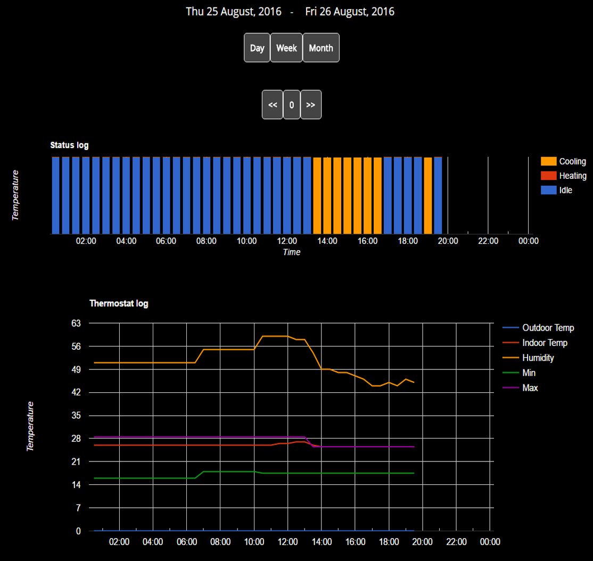

# LennoxThermoPi-II
Lennox iComfort thermostat logging and control.

This is based on the work of 'cat brain' who sniffed the API lennox uses with their Android app.
This allowed us to retrieve a much cleaner way to commnuicate both ways to our thermostats.

See 'lennoxAPI.html' for the full API calls available.

There are two parts to this project.

thermoPi.py
--------------

First a python script that is run as a service (on a RaspberryPi).
Just add you myicomfort.com login details to the script.

It currently logs:

- indoor temperature
- outdoor temperature
- minimum set (A/C)
- maximum set (Heating)
- humidity
- satus (HEATING, COOLING, IDLE)

index.html
--------------

The second part is a web page to visualize the data that is logged.
It uses the Google Graph API for graphing.
It has the ability to see daily, weekly and monthly reports including the ability to step through the time intervals.

Day view shown below:

